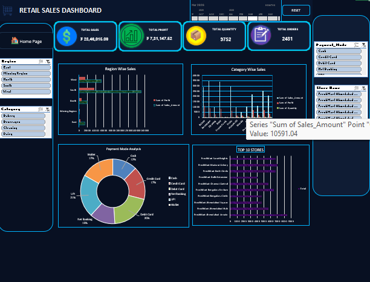

# 🛒 FreshMart Sales Analytics Dashboard

## 📌 Project Overview

**FreshMart Sales Analytics** is a retail sales analysis project developed to analyze sales transactions, customer behavior, product performance, store performance, payment methods, and profitability.

The project uses **Microsoft Excel** for data cleaning, analysis, PivotTables, and dashboard creation. The objective is to transform raw retail transaction data into meaningful business insights that can support better decision-making.

---



## 🎯 Project Objectives

* Analyze overall sales and profitability.
* Identify top-performing product categories.
* Analyze sales performance across different regions and stores.
* Understand customer membership and purchasing behavior.
* Analyze payment methods and sales channels.
* Track returned and non-returned transactions.
* Identify sales and profit trends.
* Build an interactive dashboard for management decision-making.

---

## 🧰 Tools & Technologies

| Tool                | Purpose                                 |
| ------------------- | --------------------------------------- |
| **Microsoft Excel** | Data cleaning, analysis & visualization |
| **Power Query**     | Data preparation and transformation     |
| **PivotTables**     | Aggregation and business analysis       |
| **PivotCharts**     | Data visualization                      |
| **Slicers**         | Interactive dashboard filtering         |
| **Excel Formulas**  | Calculations and data validation        |

---

## 📊 Dataset Overview

The project contains multiple related datasets:

### 1. Supplier

Contains supplier information such as:

* Supplier ID
* Supplier Name
* Contact Person
* City
* Lead Time
* Rating
* Supplier Status

### 2. Store

Contains information about FreshMart stores:

* Store ID
* Store Name
* Manager
* Region
* City
* State
* Store Type
* Opening Date
* Monthly Target
* Status

### 3. Products

Contains product master data:

* Product ID
* Product Name
* Category
* Subcategory
* Brand
* Cost Price
* Selling Price
* Supplier
* Season
* Product Status

### 4. Employee

Contains employee information:

* Employee ID
* Employee Name
* Gender
* Department
* Salary
* Joining Date
* Store ID
* Employment Status

### 5. Customer

Contains customer information:

* Customer ID
* Customer Name
* Gender
* Date of Birth
* City
* State
* Region
* Membership
* Registration Date

### 6. Sales Transactions

The main analytical dataset contains **2,500 sales transactions**.

Important fields include:

* Invoice Number
* Transaction Date
* Customer ID
* Product ID
* Product Name
* Category
* Store ID
* Region
* Employee ID
* Quantity
* Unit Price
* Discount
* Sales Amount
* Cost Amount
* Profit
* Payment Mode
* Return Status
* Sales Channel
* Order Time
* Day Type

---

## 📈 Key Project Metrics

Based on the cleaned transaction dataset:

| KPI                 |             Value |
| ------------------- | ----------------: |
| Total Transactions  |         **2,500** |
| Total Quantity Sold |         **9,823** |
| Total Sales         | **₹28,68,432.60** |
| Total Cost          | **₹21,55,163.05** |
| Total Profit        |  **₹7,37,358.89** |
| Total Discount      |  **₹2,07,875.96** |
| Product Categories  |            **14** |
| Regions             |             **5** |
| Sales Channels      |             **3** |

> The KPI values are calculated from the project's `Sales_Transactions` sheet.

---

## 📊 Dashboard

The project includes an interactive **FreshMart Sales Dashboard** designed to provide a quick overview of business performance.

### Dashboard Analysis

The dashboard focuses on:

* 💰 Total Sales
* 📈 Total Profit
* 🛍️ Quantity Sold
* 🧾 Number of Transactions
* 🏷️ Category Performance
* 🌎 Regional Performance
* 🏪 Store Performance
* 💳 Payment Mode Analysis
* 📱 Sales Channel Analysis
* 🔄 Return Analysis
* 👥 Customer Membership Analysis
* 📅 Sales Trends

Users can interact with the dashboard using **PivotTable filters and slicers** to explore different parts of the business.

---

## 🔍 Data Cleaning

The raw data was reviewed and cleaned before analysis.

Major data-quality issues considered include:

* Missing categories
* Missing regions
* Missing membership values
* Inconsistent capitalization
* Extra spaces in categorical values
* Different representations of payment modes
* Duplicate or unnecessary columns
* Incorrect/inconsistent data formats

Examples of inconsistent values identified include:

```text
CASH
cash
Cash
```

and membership values such as:

```text
GOLD
Gold
 Gold
BRONZE
Bronze
Silver
Silver 
```

These values should be standardized before creating reliable business analysis.

---

## 🧮 Important Calculations

### Sales Amount

```text
Sales Amount = Quantity × Unit Price − Discount Amount
```

### Profit

```text
Profit = Sales Amount − Cost Amount
```

### Profit Margin

```text
Profit Margin = (Profit / Sales Amount) × 100
```

These calculations help measure both revenue generation and business profitability.

---

## 📌 Business Questions Answered

The project can help answer questions such as:

1. Which product categories generate the highest sales?
2. Which categories generate the highest profit?
3. Which region performs best?
4. Which stores have the highest sales?
5. Which payment method is most frequently used?
6. Which sales channel generates the most revenue?
7. How much business comes from different membership groups?
8. What percentage of transactions are returned?
9. Which products have strong sales but low profitability?
10. How do sales vary between weekdays and weekends?
11. Which stores or regions need improvement?
12. Where can discounts be optimized?

---

## 💡 Business Insights

The analysis can be used to identify:

### Product Strategy

Focus inventory and promotions on high-sales and high-profit products while reviewing low-performing products.

### Store Performance

Compare stores and regions to identify high-performing locations and stores that require operational improvement.

### Customer Strategy

Analyze membership groups to develop targeted offers and improve customer retention.

### Sales Channel Strategy

Compare **In-Store, Online, and Mobile App** performance to understand customer purchasing preferences.

### Discount Optimization

Evaluate whether discounts are increasing sales sufficiently to justify their impact on profit.

### Return Management

Analyze returned transactions to identify products, stores, or channels with unusually high return rates.

---

## 📂 Excel Workbook Structure

```text
FreshMart_Sales_Transactions_Cleaned_Sheet.xlsx
│
├── Supplier
├── Store
├── Products
├── Employee
├── Customer
├── Sales_Transactions
├── PT_Category
├── PT_Region
├── PT_Payment
├── PT_Store
└── DASHBOARD
```

---

## 🔄 Project Workflow

```text
Raw Sales Data
      ↓
Data Cleaning
      ↓
Data Transformation
      ↓
Data Validation
      ↓
PivotTables
      ↓
KPI Calculation
      ↓
Data Visualization
      ↓
Interactive Dashboard
      ↓
Business Insights
      ↓
Recommendations
```

---

## 🚀 Skills Demonstrated

This project demonstrates practical knowledge of:

* Microsoft Excel
* Data Cleaning
* Data Transformation
* Data Analysis
* PivotTables
* PivotCharts
* Dashboard Development
* KPI Development
* Data Visualization
* Business Intelligence
* Retail Analytics
* Business Insights
* Decision Making

---

## 📌 Project Outcome

The FreshMart Sales Analytics project converts transactional retail data into an interactive business intelligence dashboard.

It provides management with a centralized view of **sales, profit, customers, products, stores, regions, payment methods, sales channels, and returns**, helping them make data-driven business decisions.

---

## 👨‍💻 Author

**M. A. Abdul Kathar**

**Role:** Aspiring Data Analyst

**Skills:**
`Excel` `SQL` `Python` `Data Analytics` `Data Visualization` `Machine Learning`

---

## ⭐ Project Highlights

> **2,500+ transactions analyzed**
> **₹28.68 Lakhs+ sales analyzed**
> **₹7.37 Lakhs+ profit analyzed**
> **Interactive Excel dashboard**
> **Retail business insights & recommendations**

---

## 📜 License

This project is created for **educational and portfolio purposes**.
