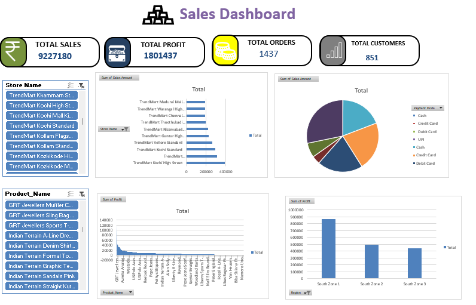

# TrendMart Fashion Enterprise – Excel Dashboard

## 📊 Project Overview




**TrendMart Fashion Enterprise – Sales & Business Analytics Dashboard** is an Excel-based data analytics project designed to analyze retail fashion sales, customers, products, stores, employees, suppliers, and data quality.

The project uses an enterprise dataset and an interactive **Dashboard** sheet to provide business-focused insights into sales performance, profitability, products, regions, stores, and payment/sales channels.

## 🎯 Project Objectives

* Analyze overall sales and profit performance.
* Identify high-performing products, stores, and regions.
* Understand customer and sales trends.
* Analyze payment modes and sales channels.
* Track product, store, employee, and supplier information.
* Identify data-quality issues.
* Present business insights through an interactive Excel dashboard.

## 🗂️ Workbook Structure

| Sheet                | Description                  |
| -------------------- | ---------------------------- |
| `Dashboard`          | Main interactive dashboard   |
| `Sales_Transactions` | Transaction-level sales data |
| `Customers`          | Customer master data         |
| `Products`           | Product master data          |
| `Stores`             | Store master data            |
| `Employees`          | Employee information         |
| `Suppliers`          | Supplier information         |
| `Data_Quality_Log`   | Data-quality issues          |
| `Region D`           | Region reference data        |
| `Store D`            | Store reference data         |
| `product D`          | Product reference data       |
| `Payment D`          | Payment-mode reference data  |

## 📍 Dashboard Path

```text
Excel Workbook
    ↓
Dashboard Sheet
    ↓
Interactive Charts & Business Insights
```

**Dashboard Location:**
`TrendMart_Fashion_Enterprise_Dataset DashBoard (1).xlsx` → **Dashboard**

## 📈 Dashboard Analysis

The dashboard provides analysis of:

* Sales performance
* Profit performance
* Product performance
* Store performance
* Regional performance
* Payment modes
* Sales channels
* Sales trends
* Business KPIs

## 🧹 Data Quality

The project includes a dedicated **`Data_Quality_Log`** sheet to document and monitor data-quality issues.

The data preparation process includes:

1. Reviewing transaction data.
2. Checking missing and inconsistent values.
3. Validating master-data relationships.
4. Recording issues in the Data Quality Log.
5. Preparing data for analysis.
6. Creating dashboard visualizations.

## 🛠️ Tools Used

* Microsoft Excel
* Excel Tables
* Excel Formulas
* Data Cleaning
* Data Validation
* Data Visualization
* Dashboard Development
* Business Analytics

## 📊 Dataset

The workbook contains:

* **3,000 Sales Transactions**
* **850 Customers**
* **250 Products**
* **120 Stores**
* **300 Employees**
* **90 Suppliers**
* **Transaction Period:** April 2024 – March 2025

## 💡 Key Business Questions

The dashboard helps answer:

* Which products generate the highest sales?
* Which products generate the highest profit?
* Which stores perform best?
* Which regions contribute the most revenue?
* Which payment modes are commonly used?
* Which sales channels perform best?
* What are the major sales trends?
* Where are data-quality problems occurring?

## 🚀 How to Use

1. Open the Excel workbook.
2. Select the **Dashboard** sheet.
3. Review the KPIs and visualizations.
4. Use the supporting sheets for detailed analysis.
5. Check `Data_Quality_Log` for documented data-quality issues.

## 📁 Repository Structure

```text
TrendMart-Fashion-Enterprise-Analytics/
│
├── README.md
│
├── Excel/
│   └── TrendMart_Fashion_Enterprise_Dataset DashBoard (1).xlsx
│
└── Dashboard/
    └── TrendMart Fashion Enterprise Dashboard
```

## 🎓 Skills Demonstrated

* Data Analytics
* Microsoft Excel
* Data Cleaning
* Data Visualization
* Dashboard Development
* Business Intelligence
* KPI Analysis
* Retail Analytics
* Data Quality Management
* Business Insight Generation

## 👨‍💻 Author

**Abdul Kathar M A**

**Data Analyst | Data Analytics Enthusiast**

---

⭐ **TrendMart Fashion Enterprise Dashboard** transforms retail transaction data into meaningful business insights using Excel-based data analytics and visualization.
